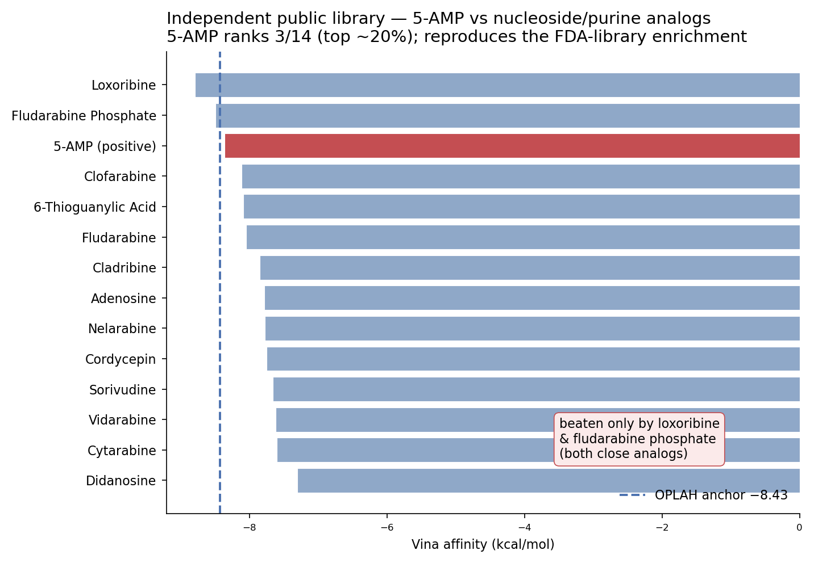

# Validation

The pipeline is validated **retrospectively** on OPLAH / 5-AMP: does docking-alone,
with no tuning, recover the one experimentally-known modulator out of a large library?
Two independent libraries, one publishable in full and one confidential.

---

## 1. Public library (reproducible — rebuild it yourself)

An approved-drug library of **1,431 compounds** built entirely from public ChEMBL data
(name-stem × `max_phase=4` queries, RDKit-standardised, drug-like-filtered). No dependency
on any proprietary data — the recipe and the built `library.tsv` are fully open, so anyone
can reproduce this from scratch.

Docked into the OPLAH box with the pipeline's own parameters (center −25.6/−7.46/18.85,
22 Å cube, Vina exhaustiveness 12, num_modes 5, seed 42; no tuning).

**Hard-negative layer (complete):** 5-AMP docks at **−8.36 kcal/mol** and ranks **3 / 14**
among the nucleoside/purine analogs in the library, beaten only by two very close analogs
(loxoribine, fludarabine phosphate).

**Global-enrichment layer:** the full 1,431-ligand percentile is *not* reported here — a
CPU screen of this size needs several uninterrupted compute-hours and could not complete in
the interactive build environment (see `FAILURE_MODES.md`). The resumable docker and the
library ship in the repo so you can finish it on a workstation or cluster.

---

## 2. FDA library (confidential — numbers only)

The original OPLAH study screened an **FDA-approved library (~1,150 experimentally-tested
compounds)** in which **5-AMP is the sole confirmed enhancer** and every other compound is
an experimental negative. This library is a **confidential experimental asset and is NOT
distributed with this repo** — only the aggregate outcome numbers are reported:

- **Global rank: top ~9 %** (101 / 1149) — enriched over the bulk of inactives;
- **Hard-negative rank: 1 / 22** — 5-AMP out-scores every close nucleoside/purine analog present;
- **False-positive rate: 7.4 %** of inactives beat the 5-AMP anchor (−8.43 kcal/mol).

No compound identities, CAS numbers, or list membership from this library appear anywhere
in the repository.

---

## What the two libraries agree on

Across a confidential experimental library and an independent public one, **5-AMP
consistently enriches to the top of its structural-analog class** (1/22 and 3/14). The
*exact* rank depends on which competitors are present — a more honest and generalizable
claim than "always #1". This is the ceiling the M5 diagnostic predicts: 5-AMP is
induced-fit limited in the apo model (`pose_trust 0.59`), so docking-score-alone enriches
strongly but does not perfectly rank.

**Scope caveat:** the inactives are negatives for *enhancement* while docking scores
*binding*, so these numbers measure where score-alone tops out as an *enhancer classifier*,
not a pure binding error. The tool is a hypothesis generator, not an affinity predictor.
